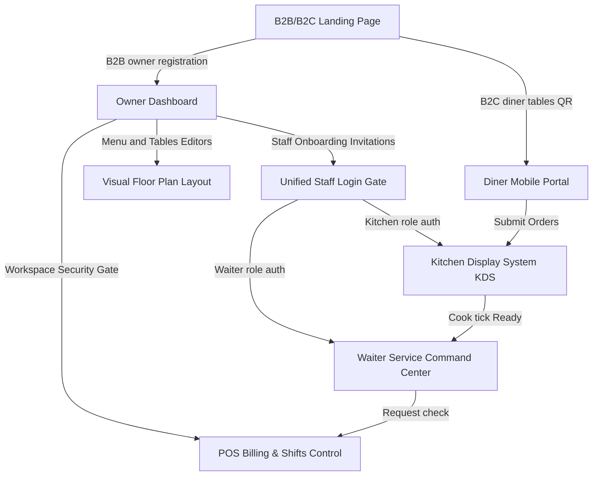

# Spiral Dine: Production-Grade Multi-Tenant Restaurant SaaS Platform (Core v1.0.0)

Spiral Dine is a modern, stable, multi-tenant B2B/B2C SaaS suite built with React 18, TypeScript, Vite, Tailwind CSS, and Firebase. It provides a complete commercial operating system for high-performance dining establishments, integrating diner portal menus, real-time kitchen queues, visual layouts, waiter dispatch command centers, POS cash drawers, refunds registers, and operational event engines.

---

## 1. Project Overview & Architecture

Spiral Dine utilizes a decentralized, multi-tenant cloud structure where all transactions are strictly scoped by `tenantId` (Restaurant ID).



---

## 2. Core Module Features

### 🔐 Authentication & Security Gates
- **Unified Staff Login Gate (`/staff/login`)**: Directs employees to respective views (Owner, Kitchen, Waiter) after validating account statuses.
- **Onboarding Activation (`/staff/activate`)**: Allows invited staff to activate profiles via emailed links, avoiding manual database entries.
- **Multi-Tenant Workspace Guard (`WorkspaceGuard.tsx`)**: Validates branch settings, subscription expiration states, and tenant deactivation profiles on dashboard switches.

### 📋 Menu & Visual Layout Editors
- **Menu Editor CRUD**: Supports Category display order dragging, veg/non-veg flags, pricing adjustments, availability toggles, and direct Firestore seeding.
- **Visual Floor Canvas**: A visual room builder with drag-and-drop coordinate positions, circles/rectangles, and instant bulk vector QR code export sheets.

### 🍳 Kitchen Display System (KDS)
- **KDS multi-views**: Real-time queues displaying Cooking Tickets, Categories, Stations, and Batch aggregators.
- **Operational actions**: Chef assignments, Pause/Resume with reason logs, back-transition Recalls, and Smart Priority weight sorting.
- **Insights metrics**: Displays preparing vs ready volumes, average preparation delays, and bottleneck indicators.

### 💁 Waiter Service Command Center
- **Shift Clocker**: Tracks shifts, breaks, and served tables.
- **Action Alerts queue**: Consolidated listings of KDS-ready pick-ups, customer assistance request alerts, table cleanup resets, and checkouts.
- **Optimal routing algorithms**: Suggests next actions by sorting by urgency priority, sections, and tables proximity.

### 🧾 POS & Billing module (v1.1)
- **Shift Drawer float**: Requires operators to input opening cash float checks, locking settlements until open.
- **Hold / Resume checks**: Pauses checkout files for ordering pauses or table changes, storing details under "Paused checks".
- **Complimentary Items Markdown**: Mark selected dishes free, resetting subtotal calculations to 0 and listing them on invoices as `Complimentary ($0.00 / ₹0)`.
- **Reprint copy counter**: Increments copy count and appends printing log entries with custom reasons on watermarked copies.
- **Shift closed discrepancies reports**: Computes expected balance vs manually entered cash, logging discrepancy statistics to the database.

---

## 3. Folder Directory Structure

```text
Project Saas for all/
├── docs/                        # Project context, logs, and backlogs
│   ├── CHANGELOG.md             # Version release notes log
│   ├── DEVELOPMENT_LOG.md       # Sprint entries and verification timelines
│   └── TASK_BOARD.md            # canonical list of all features progress
├── src/
│   ├── components/              # Shared global UI components
│   │   ├── layout/              # Nav bar, Sidebar layout shells
│   │   └── ui/                  # Design system primitives (Card, Badge, Button, Modal)
│   ├── context/                 # Context providers (Auth, Workspace validations)
│   ├── features/                # Feature-based architecture
│   │   ├── auth/                # Invitation, activation templates
│   │   ├── customer-portal/     # Diner shopping cart, tracking order pages
│   │   ├── kitchen-dashboard/   # Cooking queues, stats, timeline metrics
│   │   ├── owner-dashboard/     # Visual tables plan, staff CRUD, POS Billing
│   │   └── waiter-dashboard/    # Command center dashboard grids
│   ├── firebase/                # Centralized SDK adapters
│   │   ├── config.ts            # Firestore and Auth instances initialization
│   │   ├── firestore.ts         # Generic scoped CRUD helpers
│   │   └── collections.ts       # Central paths definition
│   ├── routes/                  # Protected routes, guards validation wrappers
│   └── utils/                   # Shared price, timestamp formatting helpers
├── firestore.rules              # Multi-tenant security rules
└── package.json                 # Node dependencies manifest
```

---

## 4. Local Installation & Environment Configurations

### Prerequisites
- Node.js v18 or later
- npm or yarn package manager
- Firebase project credentials

### Step 1: Clone and install dependencies
```bash
# Install dependencies
npm install
```

### Step 2: Configure Environment Variables
Create a `.env` file at the root based on `.env.example`:
```env
VITE_FIREBASE_API_KEY=AIzaSyA...
VITE_FIREBASE_AUTH_DOMAIN=your-app.firebaseapp.com
VITE_FIREBASE_PROJECT_ID=your-project-id
VITE_FIREBASE_STORAGE_BUCKET=your-app.appspot.com
VITE_FIREBASE_MESSAGING_SENDER_ID=1234567890
VITE_FIREBASE_APP_ID=1:1234567890:web:abcdef
```

### Step 3: Run Locally
```bash
# Start Vite development server
npm run dev
```
Open `http://localhost:5173` in your browser.

### Step 4: Build for Production
```bash
# Compile and optimize asset bundles
npm run build
```

---

## 5. Firestore Rules & Security Configuration

Deploy security parameters from `firestore.rules` to enforce absolute tenant isolation. Users are restricted to matching `tenantId` lookups:

```javascript
rules_version = '2';
service cloud.firestore {
  match /databases/{database}/documents {
    function isAuth() { return request.auth != null; }
    function getUserData() { return get(/databases/$(database)/documents/users/$(request.auth.uid)).data; }
    function isTenant(tenantId) { return isAuth() && getUserData().tenantId == tenantId; }

    match /restaurants/{tenantId}/{subcollection}/{docId} {
      allow read: if isAuth() && isTenant(tenantId);
      allow write: if isAuth() && isTenant(tenantId) && (
        getUserData().role == 'owner' || 
        getUserData().role == 'admin' ||
        (subcollection == 'orders' && (getUserData().role == 'waiter' || getUserData().role == 'kitchen' || getUserData().role == 'customer'))
      );
    }
  }
}
```

---

## 6. Future Roadmap (v2.0 platform)
- **Stripe tables-side settlement**: Seamless cashless checkout integrations for diners.
- **Dynamic combos builder**: Modals allowing modifiers, add-ons, and group pricing combos.
- **Audible Alerts**: Station alerts for high-priority tickets.
- **Multi-Branch analytics aggregates**: Cross-location BI monitoring for owners.
